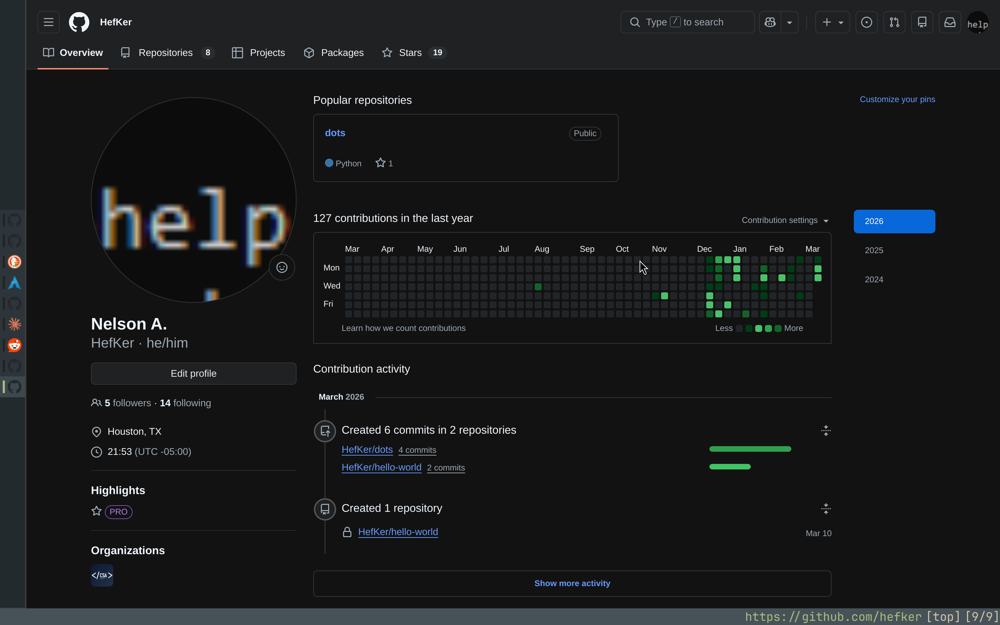
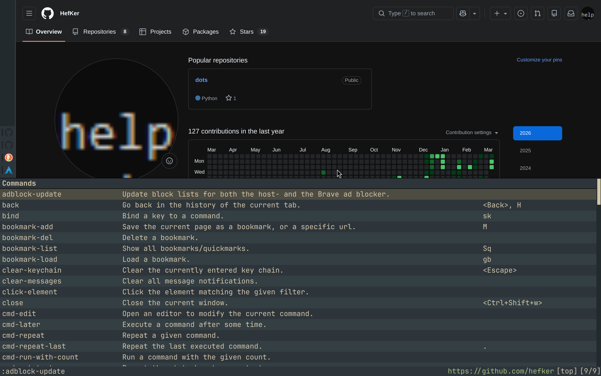

# dots

My dotfiles for my NixOS setup, managed with [GNU Stow](https://www.gnu.org/software/stow/).

## Layout

Each top-level dir is a stow package. Its tree mirrors what gets symlinked into `$HOME`:

```
<pkg>/.config/<app>/...   →   ~/.config/<app>/...
```

Apply / remove / restow:

```sh
stow -t ~ <pkg>
stow -D -t ~ <pkg>
stow -R -t ~ <pkg>
```

## Packages

| Pkg | App | Notes |
|-----|-----|-------|
| [`fish`](fish/) | fish shell | Vi keys, zoxide-shadowed `cd`, FZF widgets, custom `yt_chat` / `yt_summarize` functions wrapping the `claude` CLI. |
| [`niri`](niri/) | [niri](https://github.com/YaLTeR/niri) Wayland compositor | `config.kdl` `include`s split files under `dms/` (binds, outputs, windowrules, …). Driven by DMS. |
| [`DankMaterialShell`](DankMaterialShell/) | [DMS](https://github.com/AvengeMedia/DankMaterialShell) niri shell | Settings, themes, plugin metadata. |
| [`nvim`](nvim/) | Neovim | [LazyVim](https://www.lazyvim.org/) base. User plugins in `lua/plugins/`, config in `lua/config/`. |
| [`wezterm`](wezterm/) | [WezTerm](https://wezterm.org/) | `wezterm.lua` loads `keys.lua` and sets `color_scheme = "dank-theme"` from `colors/dank-theme.toml`. |
| [`herdr`](herdr/) | [herdr](https://herdr.dev) agent multiplexer | `config.toml` only — see note below. |
| [`qutebrowser`](qutebrowser/) | [qutebrowser](https://qutebrowser.org/) | Multi-file config split across `appearance`, `privacy`, `filepicker`, `binds`, `search_engines`. Themes under `themes/`. See deps below. |
| [`mpv`](mpv/) | [mpv](https://mpv.io/) | `mpv.conf` + `input.conf`. |

> [!NOTE]
> `~/.config/herdr/` is also herdr's runtime state dir (`*.sock`, `session.json`, logs), so only `config.toml` is stowed rather than the whole directory.

### Non-stow dirs

- [`syncthing/`](syncthing/) — Shared `.stglobalignore` across all Syncthing folders/hosts. Symlinked, not stowed — see [`syncthing/README.md`](syncthing/README.md).
- [`screenshots/`](screenshots/) — Preview images.

## Screenshots

| qutebrowser (everforest) | menu |
|---|---|
|  |  |

## qutebrowser deps

Detach videos (download + play locally):

- [mpv](https://mpv.io/)
- [yt-dlp](https://github.com/yt-dlp/yt-dlp)
- mpv-sponsorblock

Bitwarden:

- [rofi](https://wiki.archlinux.org/title/Rofi)
- [tldextract](https://pypi.org/project/tldextract/)
- [pyperclip](https://pypi.org/project/pyperclip/)
- bitwarden-cli

> [!NOTE]
> Bitwarden setup still flaky — slow, doesn't autofill on many sites. Testing rbw workaround

Adblock:

- [adblock](https://pypi.org/project/adblock/)
- Run `:adblock-update` in qutebrowser to refresh lists.

Spellcheck (en-US):

```sh
"$(find "$(nix-store --query --outputs "$(which qutebrowser)")" -iname 'dictcli.py' | head -1)" install en-US
```
